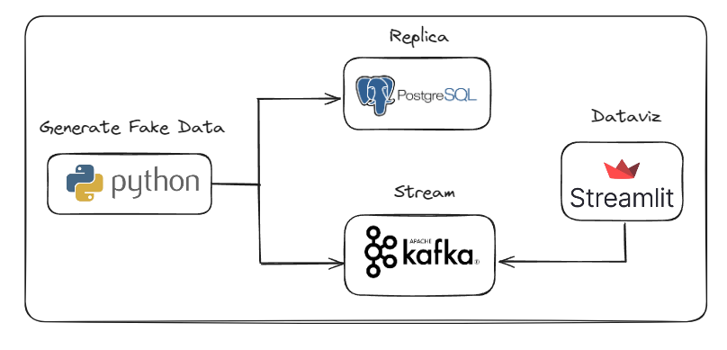
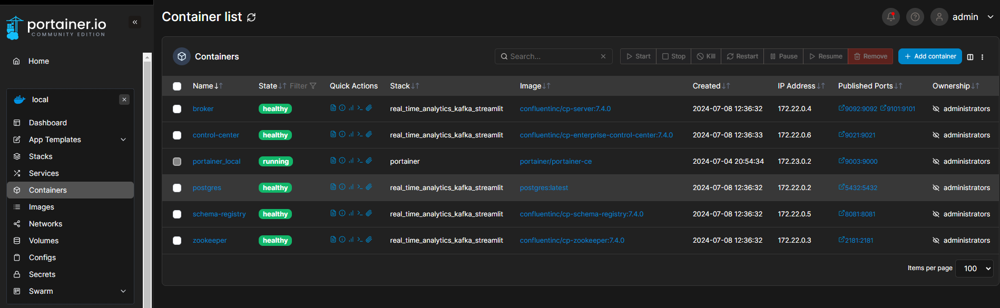
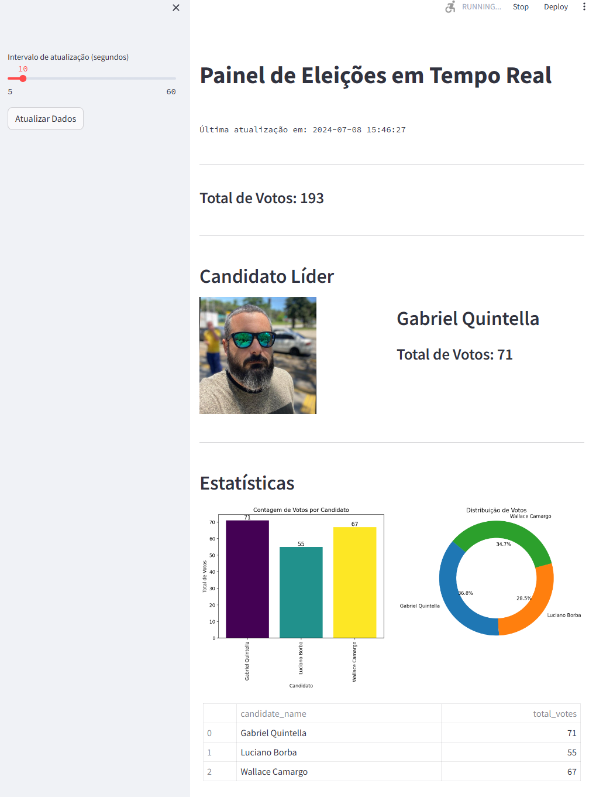

# Analise Near Real Time
Simulação de processamento de dados perto do tempo real. Neste cenário simulamos uma eleição de canditatos.

## Arquitetura



## Ferramentas

- Python
- Streamlit
- Postgres
- Kafka
------------------------------------------------------------------

## Video tutorial

https://www.youtube.com/watch?v=oS2GmnyNyUo&t=4s

## Pré-requisitos
* Docker
* Python
* Libs Python

## Como habilitar os pré-requisitos?
### Docker
Como instalar o Docker:

https://www.youtube.com/playlist?list=PLbPvnlmz6e_L_3Zw_fGtMcMY0eAOZnN-H


### Python
Instale o Python no seu sistema operacional. 

https://www.python.org/downloads/

### Libs Python
Crie o ambiente virtual
```
python -m venv venv
```
Ative o ambiente virtual (no Linux)
```
source venv/bin/activate
```
Na pasta raiz do projeto, execute o comando abaixo:
```
pip install -r requirements
```

------------------------------------------------------------------

## Steps para executar o projeto

### Subir a Stack no Docker
Na pasta raiz do projeto, digite o comando:
```
sudo docker compose up -d
```
sample container running:


------------------------------------------------------------------

## Como acessar os serviços?

### Tópicos do Kafka

localhost:9021

### Postgres

host+port:5432

username:postgres

password:postgres

database: voting

-----------------------------------------------------
## Como gerar os dados?

### Execute o script ```producer.py``` na pasta src

### Execute o script ```voting.py``` na pasta src

-----------------------------------------------------

### Rodar o Streamlit
```
streamlit run streamlit-app.py 
```
Sample dashboard running:


### Acessar o Streamlit

localhost:8503

## Conclusão
Parabéns! Sua stack near real time já está no ar. 

## Referências
https://www.youtube.com/watch?v=X-JnC9daQxE&t=0s

https://github.com/airscholar/realtime-voting-data-engineering

## Developer
| Desenvolvedor      | LinkedIn                                   | Email                        | Portfólio                              |
|--------------------|--------------------------------------------|------------------------------|----------------------------------------|
| Wallace Camargo    | [LinkedIn](https://www.linkedin.com/in/wallace-camargo-35b615171/) | wallacecpdg@gmail.com        | [Portfólio](https://wlcamargo.github.io/)   |


